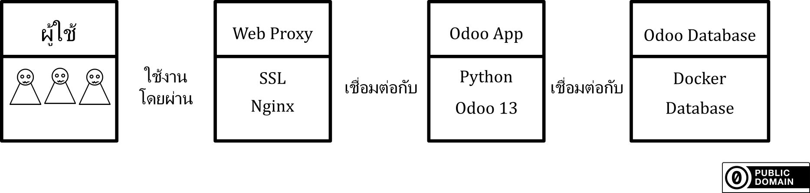

การติดตั้ง odoo13

Database  
- setup database
- ติดตั้ง docker
- tuning database web https://pgtune.leopard.in.ua/#/
- การย้าย database

Odoo
- build and install python version
- install odoo from official
- install nginx proxy
- config dns to server
- install let's encrypt
- config let's encrypt
- config nginx proxy

Note:
```shell
install python
sudo apt-get install libssl-dev openssl
wget https://www.python.org/ftp/python/3.5.0/Python-3.5.0.tgz
tar xzvf Python-3.5.0.tgz
cd Python-3.5.0
./configure
make
sudo make install
```
---  
# เกริ่นนำ
  

ระบบ odoo13 จะมีส่วนที่ต้องทำความเข้าใจทั้งหมด 4 ส่วนด้วยกัน  
1. ผู้ใช้ คือ ผู้ใช้งานระบบ ทั้งผู้ใช้งานทั่วไป และ เราซึ่งผู้ทำการติดตั้งระบบ  
2. Web Proxy ใช้สำหรับสร้างช่องทางการเชื่อมต่อแบบเข้ารหัส https จำเป็นต้องมีการตั้งค่าการเข้ารหัส SSL  
3. Odoo App เป็นส่วนการทำงานของระบบ  
4. Odoo Database ฐานข้อมูลของระบบ  

โดยทั้ง Web Proxy, Odoo App และ Odoo Database สามารถแยกเครื่องติดตั้งคนละเครื่อง หรือ จะติดตั้งรวมเครื่องเดียวเลยก็ได้ ในวิธีการติดตั้งที่จะอธิบายต่อไปนี้ จะแบ่งการติดตั้งออกแบบส่วน ๆ เพื่อให้สะดวกต่อการนำไปประยุกต์ใช้  
ในการติดตั้งเพื่อให้สะดวกแก่การตั้งค่าลำดับการติดตั้งจะเป็นดังนี้  
1. ติดตั้ง Odoo Database  
  1.1 ติดตั้ง Docker  
  1.2 ติดตั้ง Database  
2. ติดตั้ง Odoo App  
  2.1 ติดตั้ง Python แบบ Build เอง  
  2.2 ติดตั้ง Odoo  
3. ติดตั้ง Web Proxy  
  3.1 ติดตั้ง Nginx  
  3.2 การ Setup ssl ด้วย Note: (cloud flare proxy หรือ letsencrypt ดี)  
  3.3 Config Nginx สำหรับ Odoo Note: (https://www.odoo.com/documentation/14.0/administration/deployment/deploy.html#id7)
