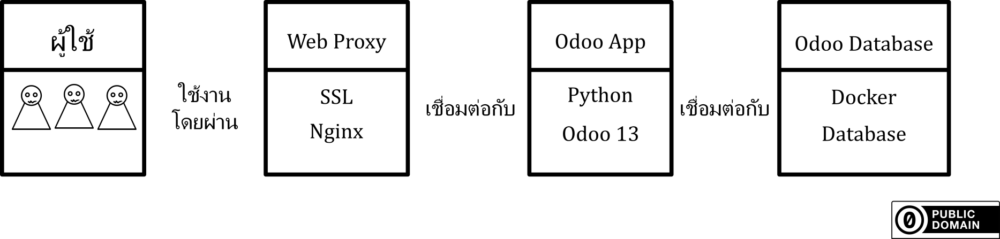

# Guide คู่มือการติดตั้ง Odoo13
## สถานะ กำลังรวบรวมข้อมูลเพื่อจัดทำเอกสาร
---  
# เกริ่นนำ
  

ระบบ odoo13 จะมีส่วนที่ต้องทำความเข้าใจทั้งหมด 4 ส่วนด้วยกัน  
1. ผู้ใช้ คือ ผู้ใช้งานระบบ ทั้งผู้ใช้งานทั่วไป และ เราซึ่งผู้ทำการติดตั้งระบบ  
2. Web Proxy ใช้สำหรับสร้างช่องทางการเชื่อมต่อแบบเข้ารหัส https จำเป็นต้องมีการตั้งค่าการเข้ารหัส SSL  
3. Odoo App เป็นส่วนการทำงานของระบบ  
4. Odoo Database ฐานข้อมูลของระบบ  

โดยทั้ง Web Proxy, Odoo App และ Odoo Database สามารถแยกเครื่องติดตั้งคนละเครื่อง หรือ จะติดตั้งรวมเครื่องเดียวเลยก็ได้ ในวิธีการติดตั้งที่จะอธิบายต่อไปนี้ จะแบ่งการติดตั้งออกแบบส่วน ๆ เพื่อให้สะดวกต่อการนำไปประยุกต์ใช้  
ในการติดตั้งเพื่อให้สะดวกแก่การตั้งค่าลำดับการติดตั้งจะเป็นดังนี้  
1. ติดตั้ง Odoo Database  
  1.1 [ขั้นแรกติดตั้ง Docker](docker_install)  
  1.2 [ขั้นสองติดตั้ง Database](database_install)  
2. ติดตั้ง Odoo App  
  2.1 [ขั้นแรกติดตั้ง Python แบบ Build เอง](python_install)  
  2.2 [ขั้นสองติดตั้ง Odoo](odoo_install)  
3. [ติดตั้ง Web Proxy](proxy_ssl_install)  

---
# การโยกย้ายข้อมูล
วิธีการย้ายระบบ หรือ จะเรียกว่าการ Clone ระบบ หรือ อาจใช้ในการบวนการ Backup ข้อมูลระบบ  
การยย้ายระบบ ไปยังเครื่องใหม่ ในเครื่องใหม่นั้นต้องทำการติดตั้งระบบ Odoo ให้เสร็จทั้งหมดก่อน  แล้วทำตามข้อปฏิบัติดังนี้
1. [กระบวนการสำรองข้อมูล](backup)
  - [การ Backup Odoo App](backup)
  - [การ Bakcup Odoo Database](backup)
2. [กระบวนการกู้คืนข้อมูล](restore)
  - [การ Restore Database](restore)
  - [การ Restore APP](restore)
3. [Guideline การย้ายระบบ](migration)
