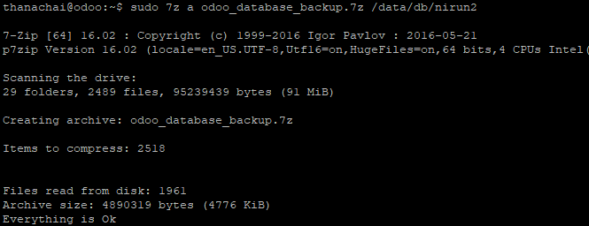

# การสำรองข้อมูล
  

การสำรองข้อมูลสำหรับในระบบ Odoo เราจะแบ่งการสำรองข้อมูล ออกเป็น 2 ส่วนคือ  
1. Odoo App
  - odoo13.conf ไฟล์ตั้งค่า Odoo
  - Odoo App ไฟล์ Python ของระบบ Odoo รวมถึง Module และ ไฟล์ที่เกี่ยวข้อง
2. Odoo Database ฐานข้อมูลระบบ Odoo

## ข้อควรระวังในการสำรองข้อมูล
ก่อนที่จะทำ สำรองข้อมูลถ้าเป็นไปได้ ควรหยุดบริการการทำงานของ Process ในระบบที่เกี่ยวข้องก่อน

### การหยุดระบบ Odoo App
ใช้คำสั่งหยุดบริการ Odoo App ที่เครื่องที่ได้ติดตั้งด้วยคำสั่ง
```sh
sudo systemctl stop odoo13.service
```

### การหยุดระบบ Odoo Database
ใช้คำสั่งหยุดบริการ Odoo Database ที่เครื่องที่ได้ติดตั้งด้วยคำสั่ง
```sh
docker service scale nirun_database=0
```
  

---
## การสำรองข้อมูล Odoo App
1. ตรวจสอบว่าบริการ Odoo App ได้หยุดทำงานแล้วด้วยคำสั่ง
```sh
sudo systemctl status odoo13.service
```
  

2. ทำการสำรองข้อมูล
ในที่นี้จะใช้ 7zip แล้วแต่สะดวก จะใช้ zip หรือเครื่องมืออื่น ๆ ก็ได้ตามสะดวก
```sh
sudo 7z a odoo_backup.7z /opt/odoo13
```
  
รอจนกว่าจะทำการสำรองข้อมูลเสร็จ

3. สำรองข้อมูลไฟล์ `odoo13.conf` ด้วยคำสั่ง
```sh
sudo cp /etc/odoo13.conf .
```

4. ตรวจสอบไฟล์ที่สำรองด้วยคำสั่ง
```sh
ls -alh odoo_backup*
```
  

## การสำรองข้อมูล Odoo Database
1. ตรวจสอบว่าบริการ Odoo Database ได้หยุดทำงานแล้วด้วยคำสั่ง
```sh
docker service ls
```
  
ตรวจสอบว่า `nirun_database` มีค่า REPLICAS เป็น 0/0 แล้ว

2. ทำการสำรองข้อมูล
ในที่นี้จะใช้ 7zip แล้วแต่สะดวก จะใช้ zip หรือเครื่องมืออื่น ๆ ก็ได้ตามสะดวก
```sh
sudo 7z a odoo_database_backup.7z /data/db/nirun2
```
  

3. ตรวจสอบไฟล์ที่สำรองด้วยคำสั่ง
```sh
ls -alh odoo_database_backup*
```


## การเริ่มบริการอีกครั้ง
### การเริ่มระบบ Odoo Database
ใช้คำสั่งเริ่มระบบ Odoo Database ที่เครื่องที่ได้ติดตั้งด้วยคำสั่ง
```sh
docker service scale nirun_database=1
```
ตรวจสอบสถานะด้วยคำสั่ง
```sh
docker service ls
```
  
ตรวจสอบว่า `nirun_database` มีค่า REPLICAS เป็น 1/1 แล้ว

### การเริ่มระบบ Odoo App
ใช้คำสั่งเริ่มระบบที่ติดตั้ง Odoo App ด้วยคำสั่ง
```sh
sudo systemctl start odoo13.service
```
ตรวจสอบได้ด้วยคำสั่ง
```sh
sudo systemctl status odoo13.service
```
  
