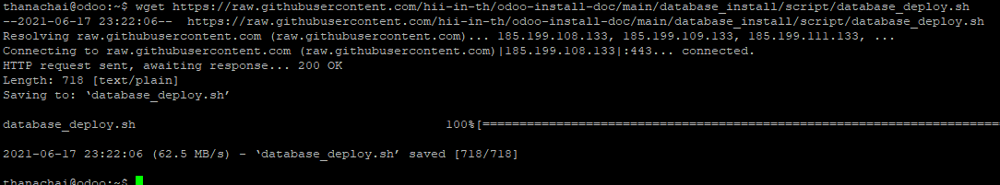

# การติดตั้ง Odoo Database
ตัว Database ที่จะยกตัวอย่างในการติดตั้งจะทำงานอยู่บนระบบ Docker service ในส่วนนี้หากผู้ใช้เชี่ยวชาญด้านอื่นๆ ไม่ว่าจะเป็น การติดตั้งบนเครื่องโดยตรง หรือ ตามเว็บหลายที่จะติดตั้งบน Docker compose ก็แล้วแต่ไม่ว่ากัน  
รายละเอียด Database จะใช้ PostgreSQL version 10  
เอกสารอ้างอิงการติดตั้งด้วย docker https://hub.docker.com/_/postgres

---
# เริ่มการติดตั้ง Database
1. สร้างส่วนจัดเก็บไฟล์ Database โดยใช้คำสั่ง
```sh
sudo mkdir -p /data/db/nirun2
```


2. ดึง Script การติดตั้งโดยใช้คำสั่ง
```sh
wget https://raw.githubusercontent.com/hii-in-th/odoo-install-doc/main/database_install/script/database_deploy.sh
```


แนะนำให้แก้ไข script `database_deploy.sh` ทำการแก้ไขรหัสผ่านใหม่ หากไม่แก้ไขจะมี user และ รหัสติดมาให้ คือ
- user `nirun`
- password `WKztnwB77XAE84YaKjJRBbvnXav334`
- database `nirun`

3. เริ่มการทำงานของ Database ด้วยคำสั่ง
```sh
sh database_deploy.sh
```
