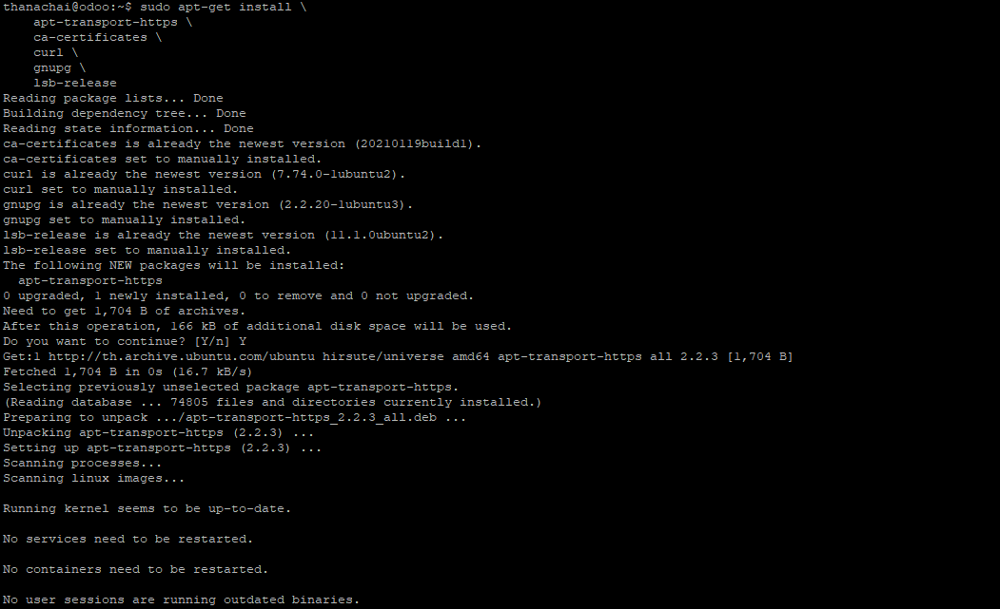
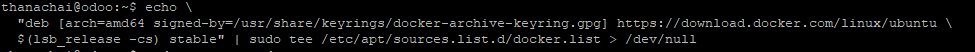
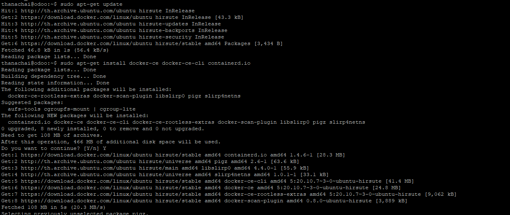
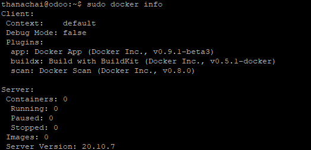
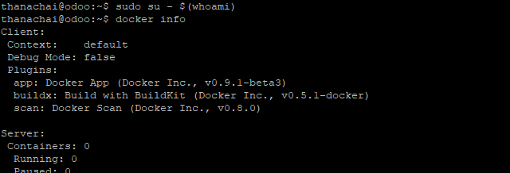
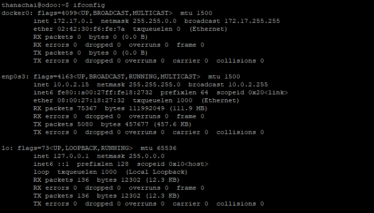
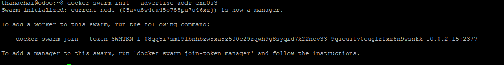

# การติดตั้ง Docker  
**มีข้อควรระวัง หากมีการใช้งาน Docker บน Server อยู่แล้วให้ข้ามขั้นตอนการติดตั้ง Docker เพราะในวิธีการติดตั้ง จะมีส่วนคำสั่งในการลบ Docker ของเก่าออก หากมีระบบที่กำลังทำงานอยู่บน Docker จะถูกลบไปด้วยทันที**  
**วิธีในการติดตั้งตามเอกสารนี้ ติดตั้งด้วย OS Ubuntu 20LTS หากใช้ระบบอื่นโปรดอ่านเพิ่มเติมที่เอกสารอ้างอิง**  
อ้างอิงตามเอกสาร https://docs.docker.com/engine/install/ubuntu/  
การอธิบายจะไม่ลงรายละเอียดมากเพราะว่า **มีเอกสารจากทาง Official อยู่แล้ว**  

โดยการติดตั้ง จะมีแบ่งออกเป็น 2 ส่วน  
  [1. เริ่มการติดตั้ง Docker](#เริ่มการติดตั้ง-Docker)  
  [2. การตั้งค่า docker service](#การตั้งค่า-Docker-service)

ก่อนติดตั้ง Docker ใหม่จำเป็นต้องทำการลบ Docker ตัวเดิมในระบบออกก่อน ด้วยคำสั่ง
```shell
sudo apt-get remove docker docker-engine docker.io containerd runc
```
---
## เริ่มการติดตั้ง Docker  
1. ติดตั้งส่วนที่จำเป็นสำหรับติดตั้ง Docker โดยใช้คำสั่ง
```sh
sudo apt-get update
sudo apt-get install \
    apt-transport-https \
    ca-certificates \
    curl \
    gnupg \
    lsb-release
```
ตัวอย่างผลลัพธ์จากคำสั่ง


2. เพิ่ม Docker’s official GPG key ด้วยคำสั่ง
```sh
curl -fsSL https://download.docker.com/linux/ubuntu/gpg | sudo gpg --dearmor -o /usr/share/keyrings/docker-archive-keyring.gpg
```
ตัวอย่างผลลัพธ์จากคำสั่ง


3. เพิ่ม Docker stable repository เข้าในระบบด้วยคำสั่ง
```sh
echo \
  "deb [arch=amd64 signed-by=/usr/share/keyrings/docker-archive-keyring.gpg] https://download.docker.com/linux/ubuntu \
  $(lsb_release -cs) stable" | sudo tee /etc/apt/sources.list.d/docker.list > /dev/null
```
ตัวอย่างผลลัพธ์จากคำสั่ง


4. ติดตั้ง Docker Engine ด้วยคำสั่ง
```sh
sudo apt-get update
sudo apt-get install docker-ce docker-ce-cli containerd.io
```


5. ทดสอบคำสั่ง docker โดยการใช้คำสั่ง
```sh
sudo docker info
```


6. เทคนิคไม่ลับ: เราสามารถใช้งาน Docker โดยที่ไม่ต้องใช้ sudo ได้ดังนี้
```sh
sudo usermod -aG docker $(whoami)
sudo su - $(whoami)
```
ทดสอบคำสั่ง `docker info`
```sh
docker info
```

---
## การตั้งค่า Docker service
เนื่องจาก ในเนื้อหาสำหรับการติดตั้งระบบ Odoo จะใช้วิธีการติดตั้งระบบบน docker service  ทำให้จำเป็นต้องมีการ setup ตัว docker service ขึ้นมาก่อน

1. เช็คระบบ Network interface ที่เราจะใช้เชื่อมระหว่าง Odoo app กับ Odoo Database ด้วยคำสั่ง
```sh
ifconfig
```
  

2. ดูว่าเราใช้ Network ชุดใดในการเชื่อมต่อกับ Odoo app หากเป็นเครื่องเดียวกัน ใช้อันไหนก็ได้ ในที่นี้จะใช้ 10.0.2.15 ที่ชื่อ enp0s3
```sh
docker swarm init --advertise-addr enp0s3
```
  

3. ทดสอบการ setup docker service โดยใช้คำสั่ง
```sh
docker service ls
```
  
