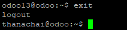
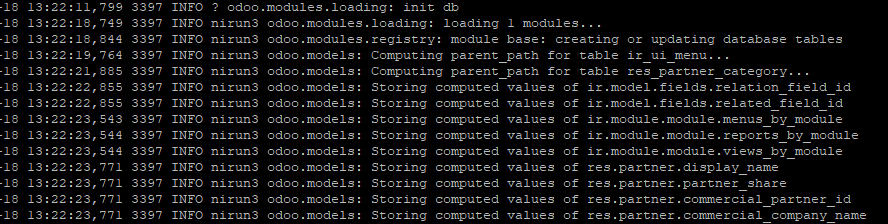

# การติดตั้ง Odoo 13
การติดตั้งในที่นี้ได้เลือก Odoo13 โดยการติดตั้งจะใช้วิธีการ ติดตั้งโดยตรงผ่าน Source code official ของ odoo จำเป็นต้องมีความความรู้เรื่องระบบ Linux กับ Python ค่อนข้างดี เพราะต้องตั้งค่า library ในข้อที่ 6 ให้เหมาะสมกับระบบ หากไม่ตั้งค่าส่วนนี้ จะติดตั้งไม่ผ่าน และตอนเริ่มการทำงาน Odoo ในข้อที่ 15 หากพบ Error แล้วไม่แก้ไข ตัว Odoo ก็จะไม่สามารถใช้งานได้

---
## เริ่มการติดตั้ง Odoo
1. download wkhtmltopdf โดยคำสั่ง
  ```sh
  wget https://github.com/wkhtmltopdf/packaging/releases/download/0.12.6-1/wkhtmltox_0.12.6-1.focal_amd64.deb
  ```


2. ติดตั้ง wkhtmltopdf โดยใช้คำสั่ง
  ```sh
  sudo apt install ./wkhtmltox_0.12.6-1.focal_amd64.deb
  ```
  

3. เพิ่ม user odoo13 สำหรับให้ระบบ Odoo ด้วยคำสั่ง
  ```sh
  sudo useradd -m -d /opt/odoo13 -U -r -s /bin/bash odoo13
  ```
  

4. ใช้ user odoo ในการติดตั้งโดยใช้คำสั่ง
  ```sh
  sudo su - odoo13
  ```
  

5. download source code Odoo official ด้วยคำสั่ง
  ```sh
  git clone https://www.github.com/odoo/odoo --depth 1 --branch 13.0 /opt/odoo13/odoo
  ```
  

6. ทำการแก้ไขไฟล์ requirements.txt ด้วยคำสั่ง vim อันนี้แล้วแต่สะดวก จะใช้ nano หรือ editor ตัวอื่นก็ได้ไม่ว่ากัน
  ```sh
  vim odoo/requirements.txt
  ```

7. การติดตั้งจะติดตั้งภายใต้ venv ใช้สำสั่งดังนี้
  ```sh
  python3.6 -m venv odoo-venv
  source odoo-venv/bin/activate
  ```
  

8. เริ่มการติดตั้ง python library ที่จำเป็นสำหรับ Odoo ด้วยคำสั่ง
  ```sh
  pip3.6 install wheel
  ```
    

  และตามด้วยคำสั่ง
  ```sh
  pip3.6 install -r odoo/requirements.txt
  ```
  

9. ติดตั้งตัวระบบ Odoo app เสร็จสมบูรณ์ ออกจากส่วนติดตั้งด้วยคำสั่ง
  ```sh
  deactivate
  ```
  

10. สร้างโฟเดอร์สำหรับเก็บ odoo custom addons ด้วยคำสั่ง
  ```sh
  mkdir /opt/odoo13/odoo-custom-addons
  ```
  

11. ออกจาก odoo13 กลับเข้าสู่ user ที่เข้ามาตอนแรก ด้วยคำสั่ง
  ```sh
  exit
  ```
  สังเกตด้านหน้าคำสั่ง ชื่อ user เปลี่ยนจาก odoo13 เป็น user ที่เราใช้งานปกติแล้ว  
  

12. สร้างไฟล์สำหรับกำหนดค่าระบบ Odoo ที่ `/etc/odoo13.conf` อาจจะใช้ nano หรือ vim ก็ได้ แล้วแต่สะดวก ในที่นี้จะใช้ vim
  ```sh
  sudo vim /etc/odoo13.conf
  ```  
  ด้านล่าง จะเป็นข้อมูลภายในไฟล์  
  ```ini
  [options]
  addons_path = /opt/odoo13/odoo/addons,/opt/odoo13/odoo-custom-addons
  proxy_mode = True
  data_dir = /opt/odoo13/data
  admin_passwd = cdMjNRZGCGWP5YysqurW7vPz
  csv_internal_sep = ,
  db_host = 10.0.2.15
  db_port = 21320
  db_user = nirun
  db_password = WKztnwB77XAE84YaKjJRBbvnXav334
  db_maxconn = 400
  db_name = nirun3
  limit_time_real = 1200
  ```
  ตัวแปรที่ต้องตั้งค่า
  - admin_passwd รหัสผ่านผู้ดูแลระบบตอนเริ่มทำงานครั้งแรก สามารถกำหนดใน Odoo App ได้
  - db_host ip address หรือ hostname ของตัว PostgreSQL ที่จะให้ Odoo เชื่อมต่อ
  - db_port port ของตัว PostgreSQL ที่จะให้ Odoo เชื่อมต่อ
  - db_user username สำหรับเข้าใช้ database
  - db_password รหัสผ่าน database ที่กำหนดตอนสร้าง database ในตัวอย่างนี้ ได้กำหนดเป็นค่าเดียวกับตอนติดตั้ง database ไว้ให้แล้ว หากตอนติดตั้งไม่ได้แก้ค่า ก็จะใช้รหัสนี้
  - db_name ชื่อ database ของระบบสามารถกำหนดเองได้  

  สำหรับการตั้งค่าขั้นสูงสามารถอ่านเพิ่มเติมได้ที่ **https://gist.github.com/Guidoom/d5db0a76ce669b139271a528a8a2a27f**  

13. สร้างไฟล์ system service สำหรับส่งคำสั่งเริ่มการทำงานของ Odoo เมื่อเปิดระบบ ได้ที่ไฟล์ `/etc/systemd/system/odoo13.service` อาจจะใช้ nano หรือ vim ก็ได้ แล้วแต่สะดวก ในที่นี้จะใช้ vim
  ```sh
  sudo vim /etc/systemd/system/odoo13.service
  ```
  ใส่ข้อมูลในไฟล์ `odoo13.service` ตามนี้
  ```ini
  [Unit]
  Description=Odoo13

  [Service]
  Type=simple
  SyslogIdentifier=odoo13
  PermissionsStartOnly=true
  User=odoo13
  Group=odoo13
  ExecStart=/opt/odoo13/odoo-venv/bin/python3 /opt/odoo13/odoo/odoo-bin -c /etc/odoo13.conf
  StandardOutput=journal+console

  [Install]
  WantedBy=multi-user.target
  ```

14. เริ่มการทำงานของ system service odoo13 ด้วยคำสั่งตามลำดับดังนี้  
  คำสั่งแจ้งอัพเดท systemd ว่ามีไฟล์ system service ใหม่ด้วยคำสั่ง  
  ```sh
  sudo systemctl daemon-reload
  ```
  ตามด้วย คำสั่งสำหรับเปิดการทำงานของ system service odoo13 ด้วยคำสั่ง
  ```sh
  sudo systemctl enable --now odoo13
  ```
    

15. สามารถตรวจสอบสถานะการทำงานของ system service odoo13 ด้วยคำสั่ง
  ```sh
  sudo systemctl status odoo13
  ```
  
  หรือสามารถตรวจสอบ log ไฟล์ดูว่าพบข้อผิดพลาดหรือไม่ ด้วยคำสั่ง
  ```sh
  sudo journalctl -u odoo13
  ```
    
  หากพบ error ในรูปแบบลักษณะคล้ายด้านล่างให้ทำการแก้ไขหน้างาน  
  
  ถ้าเป็นการติดตั้ง Odoo ใหม่หากสำเร็จจะพบบรรทัดคำสั่ง `init db` และจะไม่พบ Error ในช่วงเริ่มการทำงาน หลังจากบรรทัดนี้  
    
