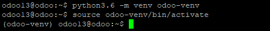

# การติดตั้ง Odoo 13
การติดตั้งในที่นี้ได้เลือก Odoo13 โดยการติดตั้งจะใช้วิธีการ ติดตั้งโดยตรงผ่าน Source code official ของ odoo จำเป็นต้องมีความความรู้เรื่องระบบ Linux ค่อนข้างดี เพราะต้องตั้งค่า library ในข้อที่ 6 ให้เหมาะสมกับระบบ หากไม่ตั้งค่าส่วนนี้ จะติดตั้งไม่ผ่าน

---
1. download wkhtmltopdf โดยคำสั่ง
  ```sh
  wget https://github.com/wkhtmltopdf/packaging/releases/download/0.12.6-1/wkhtmltox_0.12.6-1.focal_amd64.deb
  ```


2. ติดตั้ง wkhtmltopdf โดยใช้คำสั่ง
  ```sh
  sudo apt install ./wkhtmltox_0.12.6-1.focal_amd64.deb
  ```
  

3. เพิ่ม user odoo13 สำหรับให้ระบบ Odoo ด้วยคำสั่ง
  ```sh
  sudo useradd -m -d /opt/odoo13 -U -r -s /bin/bash odoo13
  ```
  

4. ใช้ user odoo ในการติดตั้งโดยใช้คำสั่ง
  ```sh
  sudo su - odoo13
  ```
  

5. download source code Odoo official ด้วยคำสั่ง
  ```sh
  git clone https://www.github.com/odoo/odoo --depth 1 --branch 13.0 /opt/odoo13/odoo
  ```
  

6. ทำการแก้ไขไฟล์ requirements.txt ด้วยคำสั่ง vim อันนี้แล้วแต่สะดวก จะใช้ nano หรือ editor ตัวอื่นก็ได้ไม่ว่ากัน
  ```sh
  vim odoo/requirements.txt
  ```

7. การติดตั้งจะติดตั้งภายใต้ venv ใช้สำสั่งดังนี้
  ```sh
  python3.6 -m venv odoo-venv
  source odoo-venv/bin/activate
  ```
  

8. เริ่มการติดตั้ง python library ที่จำเป็นสำหรับ Odoo ด้วยคำสั่ง
  ```sh
  pip3.6 install wheel
  ```
    

  และตามด้วยคำสั่ง
  ```sh
  pip3.6 install -r odoo/requirements.txt
  ```
  

9. ติดตั้งตัวระบบ Odoo app เสร็จสมบูรณ์ ออกจากส่วนติดตั้งด้วยคำสั่ง
```sh
deactivate
```
