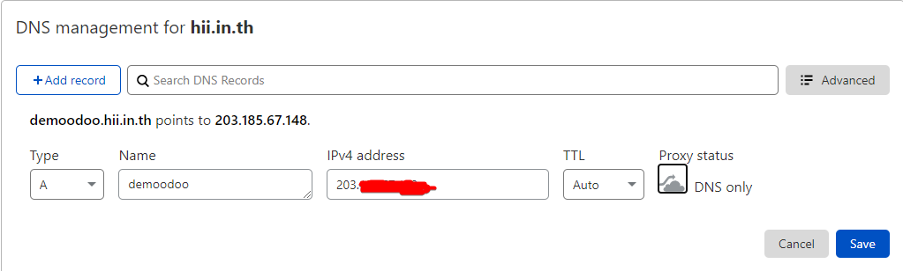
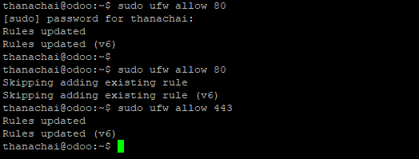
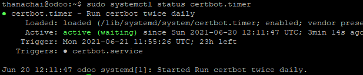
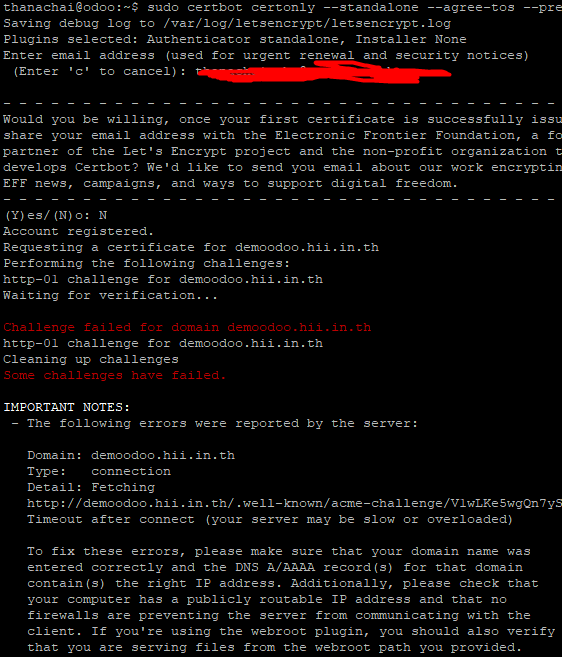
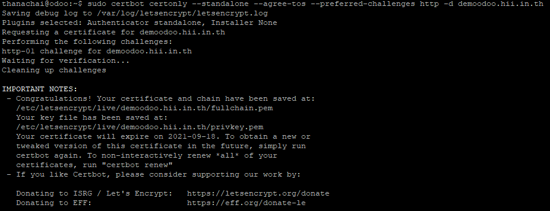
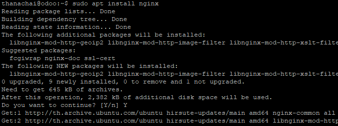
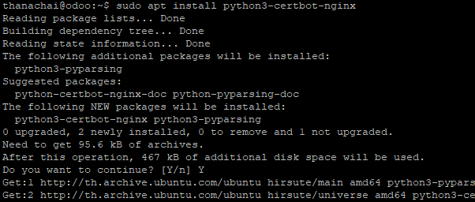
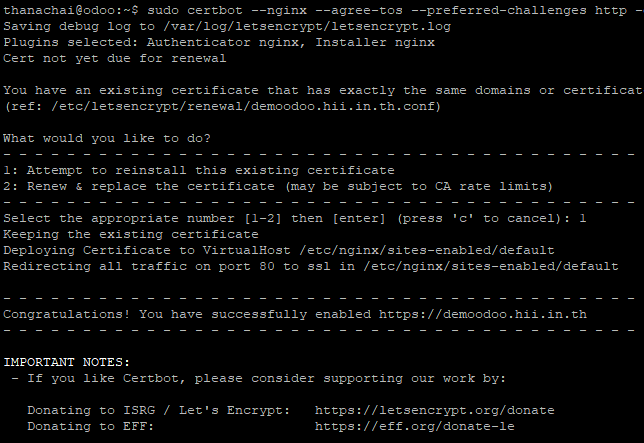
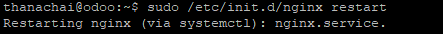
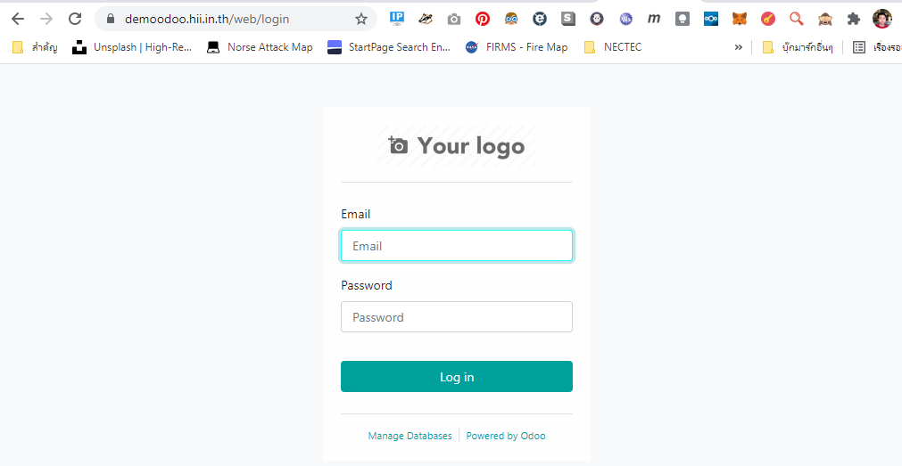

# การติดตั้ง Proxy SSL
การใช้งานให้มีความปลอดภัย อย่างน้อยก็ควรมีการเข้ารหัส https พื้นฐาน ถ้าจะปลอดภัยหน่อยอาจจะใช้พวก Cloudflare proxy ที่สามารถซ่อน ip server จากการโจมตีโดยตรงได้ แต่ไม่ใช่ว่าทุกคนจะสามารถ จ่ายเงินเข้าถึงบริการได้ ผมเลยเลือกวิธีการสร้าง SSL ด้วย Let's Encrypt มาสอนแทน อ่าวเกรินมาซะเยอะ 555+  
Let's Encrypt คือ เครื่องมือในการสร้างชุดการเข้ารหัสด้วย SSL เมื่อเอามาใช้กับระบบเว็บก็จะกลายเป็น https ในการตั้งค่าจะมีต้องทำ 2 ส่วนคือ Nginx และ Let's Encrypt เดี๊ยวเรามาเริ้มกันเลย
---
## วิธีการติดตั้ง Proxy ssl
1. ตั้งค่า dns  
  ตั้งค่า DNS A record แล้วแต่เรากำหนดในที่นี้จะใช้ demoodoo ผูกกับ ip address ของ server ที่ใช้งาน  
    

2. กลับมาที่ server ทำการอนุญาติ firewall ให้ใช้บริการ port 80 และ port 443 ด้วยคำสั่ง
  ```sh
  sudo ufw allow 80
  sudo ufw allow 443
  ```
    

3. ติดตั้ง letsencrypt ด้วยคำสั่ง
  ```sh
  sudo apt install letsencrypt
  ```
    

4. ตรวจสอบระบบต่ออายุ SSL ด้วยคำสั่ง  
  ปกติของ Let's Encrypt ใบรับรองจะมีอายุจำกัดในช่วงเวลา ไม่ยาวมากนัก หากตรวจสอบแล้ว ส่วนนี้ไม่ Online จะพบปัญหาใช้ไปได้ประมาณ 3 เดือน แล้วจะใช้ไม่ได้อีก ทั้งนี้ ระยะเวลาจะแล้วแต่ กฏของ Let's Encrypt ณ ตอนนั้น
  ```sh
  sudo systemctl status certbot.timer
  ```
    

5. กำหนดค่า Let's Encrypt ให้ขอ SSL domain ที่เรากำหนดในข้อที่ 1 ในที่นี้ได้ใช้ demoodoo.hii.in.th
  ```sh
  sudo certbot certonly --standalone --agree-tos --preferred-challenges http -d demoodoo.hii.in.th
  ```
  หากพบ Error ให้ทำการแก้ไขหน้างาน จะมีรายละเอียดบอกว่า Error เกี่ยวกับอะไร  
    

  หากสำเร็จแล้วจะแสดงดังภาพด้านล่าง จะไม่มี Error แสดง
    

6. ติดตั้ง Nginx ด้วยคำสั่ง
  ```sh
  sudo apt install nginx
  ```
    

7. ติดตั้งตัวช่วยในการตั้งค่า Nginx ด้วยคำสั่ง
  ```sh
  sudo apt install python3-certbot-nginx
  ```
    

  และตามด้วยคำสั่งด้านล่าง พารามิเตอร์เอาค่าที่เรากำหนดในข้อที่ 1 ในที่นี้ได้ใช้ demoodoo.hii.in.th
  ```sh
  sudo certbot --nginx --agree-tos --preferred-challenges http -d demoodoo.hii.in.th
  ```
  ตอบ 1  
    

8. ตั่งค่า Nginx อาจจะใช้ nano หรือ editor ตัวอื่นก็ได้ แล้วแต่สะดวก  
  ```sh
  sudo vim /etc/nginx/sites-enabled/default
  ```

  ให้ไปในส่วนตั้งค่า SSL สั่งเกตุว่า ssl ได้ถูกตั้งค่ามาให้อัตโนมัติบ้างแล้ว  
  ```lua
  listen [::]:443 ssl ipv6only=on; # managed by Certbot
  listen 443 ssl; # managed by Certbot
  ssl_certificate /etc/letsencrypt/live/demoodoo.hii.in.th/fullchain.pem; # managed by Certbot
  ssl_certificate_key /etc/letsencrypt/live/demoodoo.hii.in.th/privkey.pem; # managed by Certbot
  include /etc/letsencrypt/options-ssl-nginx.conf; # managed by Certbot
  ssl_dhparam /etc/letsencrypt/ssl-dhparams.pem; # managed by Certbot
  ```

  ให้แก้ไขไฟล์ config ตรงส่วนที่ไม่ใช่ SSL ตามนี้  
  ```lua
  # Odoo servers
  upstream odoo {
   server 127.0.0.1:8069;
  }

  upstream odoochat {
   server 127.0.0.1:8072;
  }

  server {
      server_name demoodoo.hii.in.th;

      proxy_read_timeout 720s;
      proxy_connect_timeout 720s;
      proxy_send_timeout 720s;

      # Proxy headers
      proxy_set_header X-Forwarded-Host $host;
      proxy_set_header X-Forwarded-For $proxy_add_x_forwarded_for;
      proxy_set_header X-Forwarded-Proto $scheme;
      proxy_set_header X-Real-IP $remote_addr;

      listen [::]:443 ssl ipv6only=on; # managed by Certbot
      listen 443 ssl; # managed by Certbot
      ssl_certificate /etc/letsencrypt/live/demoodoo.hii.in.th/fullchain.pem; # managed by Certbot
      ssl_certificate_key /etc/letsencrypt/live/demoodoo.hii.in.th/privkey.pem; # managed by Certbot
      include /etc/letsencrypt/options-ssl-nginx.conf; # managed by Certbot
      ssl_dhparam /etc/letsencrypt/ssl-dhparams.pem; # managed by Certbot

      # log files
      access_log /var/log/nginx/odoo.access.log;
      error_log /var/log/nginx/odoo.error.log;

      # Handle longpoll requests
      location /longpolling {
          proxy_pass http://odoochat;
      }

      # Handle / requests
      location / {
         proxy_redirect off;
         proxy_pass http://odoo;
      }

      # Cache static files
      location ~* /web/static/ {
          proxy_cache_valid 200 90m;
          proxy_buffering on;
          expires 864000;
          proxy_pass http://odoo;
      }

      # Gzip
      gzip_types text/css text/less text/plain text/xml application/xml application/json application/javascript;
      gzip on;
  }
  ```

9. โหลดการตั้งค่า Nginx ด้วยคำสั่ง
  ```sh
  sudo /etc/init.d/nginx restart
  ```
    

10. ทดสอบเข้าเว็บที่ได้กำหนดไปในข้อที่ 1  
  ในที่นี้เป็น demoodoo.hii.in.th  
   
