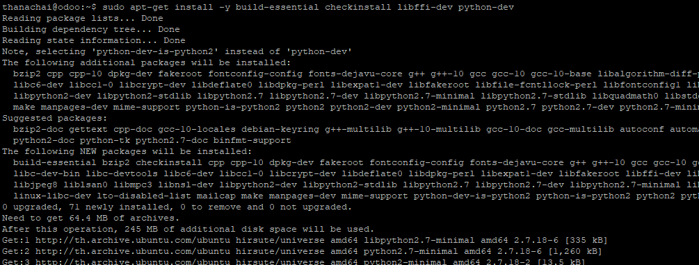
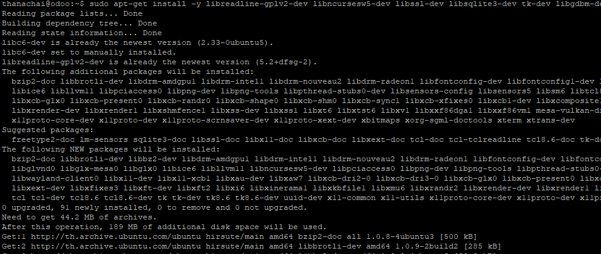
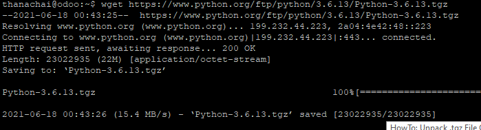
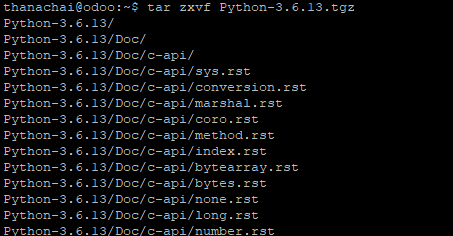

# การติดตั้ง Python
สำหรับเนื้อหาในส่วนนี้ จะเน้นไปที่วิธีการ Build code จาก Python official ส่วนเหตุผลที่เลือกวิธีการนี้มาเขียน เพราะว่า เนื้อหาส่วนการ Build code เอง ยังมีผู้ทำไม่เป็นจำนวนมาก และ เหมาะที่จะนำมาใช้กับระบบ CI/CD  
หากผู้ใช้สะดวกติดตั้งผ่าน apt หรือ yum ก็แล้วแต่สะดวก
---
# เริ่มการติดตั้ง Python
1. ติดตั้ง library ที่จำเป็นสำหรับการ Build ด้วยคำสั่ง
  ```sh
  sudo apt-get install -y build-essential checkinstall libffi-dev python-dev
  ```
  

  และตามด้วย
  ```sh
  sudo apt-get install -y libreadline-gplv2-dev libncursesw5-dev libssl-dev libsqlite3-dev tk-dev libgdbm-dev libc6-dev libbz2-dev
  ```
  

2. ดึง code python ด้วยคำสั่ง
```sh
wget https://www.python.org/ftp/python/3.6.13/Python-3.6.13.tgz
```


3. ทำการคลายไฟล์ที่ Download มาด้วยคำสั่ง
```sh
tar zxvf Python-3.6.13.tgz
```


4. ทำการ Build Python ด้วยคำสั่งดังนี้
```sh
cd Python-3.6.13/
./configure --enable-optimizations
make
sudo make install
```
