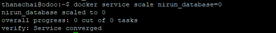
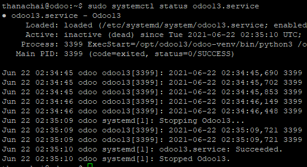
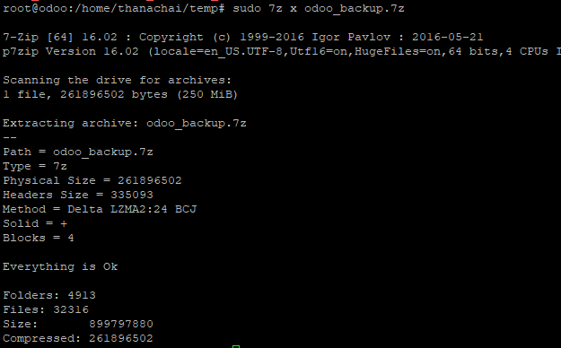
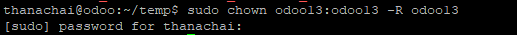
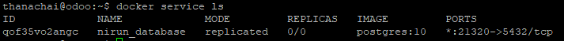
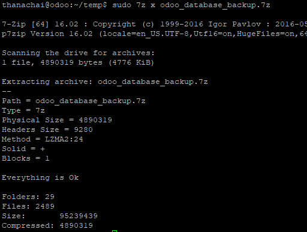
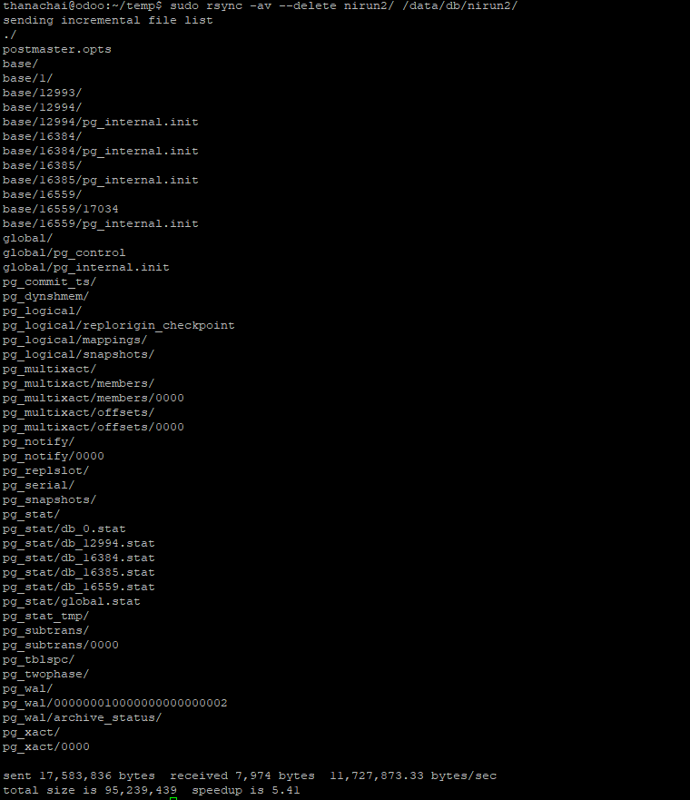
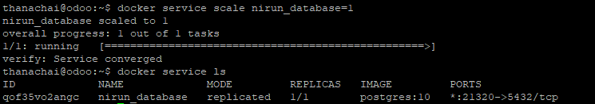
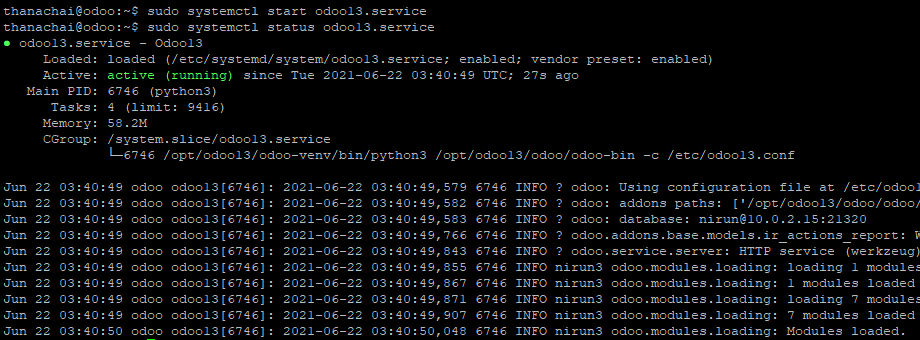

# การกู้คืนข้อมูล
  

การกู้คืนข้อมูลสำหรับในระบบ Odoo เราจะใช้ไฟล์ที่เราได้ทำการสำรองข้อมูลไว้ นำมาทำการย้อนกลับกระบวนการ เราจะแบ่งการกู้คืนข้อมูล ออกเป็น 2 ส่วนคือ  
1. Odoo App
  - odoo13.conf ไฟล์ตั้งค่า Odoo
  - Odoo App ไฟล์ Python ของระบบ Odoo รวมถึง Module และ ไฟล์ที่เกี่ยวข้อง
2. Odoo Database ฐานข้อมูลระบบ Odoo

## ข้อควรระวังในการกู้คืนข้อมูล
ก่อนที่จะทำการกู้คืนข้อมูลถ้าเป็นไปได้ ควรหยุดบริการการทำงานของ Process ในระบบที่เกี่ยวข้องก่อน

### การหยุดระบบ Odoo App
ใช้คำสั่งหยุดบริการ Odoo App ที่เครื่องที่ได้ติดตั้งด้วยคำสั่ง
```sh
sudo systemctl stop odoo13.service
```

### การหยุดระบบ Odoo Database
ใช้คำสั่งหยุดบริการ Odoo Database ที่เครื่องที่ได้ติดตั้งด้วยคำสั่ง
```sh
docker service scale nirun_database=0
```
  

---
## การกู้คืนข้อมูล Odoo App
1. ตรวจสอบว่าบริการ Odoo App ได้หยุดทำงานแล้วด้วยคำสั่ง
```sh
sudo systemctl status odoo13.service
```
  

2. เตรียมการกู้คืนข้อมูล
  สำหรับการกู้คืนข้อมูลเราจะย้อนกระบวนการ สำรองข้อมูล หากใช้วิธีไหนก็ให้ย้อนกลับ ด้วยวิธีนั้น ในที่นี้ใช้คำสั่งของ 7z ในการบีบข้อมูลไว้ ในขั้นตอนนี้ก็จะทำการ คลายไฟล์ที่บีบอัดออกมา ด้วยคำสั่ง
  ```sh
  sudo 7z x odoo_backup.7z
  ```
    
  และทำการกำหนด user:group ของระบบ odoo ให้กับไฟล์ที่คลายออกมา ด้วยคำสั่ง
  ```sh
  sudo chown odoo13:odoo13 -R odoo13
  ```
    

3. ย้ายไฟล์ที่กู้มาไปไว้ที่เดิมด้วยคำสั่ง
  ```sh
  sudo rsync -av --delete odoo13/ /opt/odoo13/
  ```

## การกู้คืนข้อมูล Odoo Database
1. ตรวจสอบว่าบริการ Odoo Database ได้หยุดทำงานแล้วด้วยคำสั่ง
  ```sh
  docker service ls
  ```
    
  ตรวจสอบว่า `nirun_database` มีค่า REPLICAS เป็น 0/0 แล้ว

2. เตรียมการกู้คืนข้อมูล
  สำหรับการกู้คืนข้อมูลเราจะย้อนกระบวนการ สำรองข้อมูล หากใช้วิธีไหนก็ให้ย้อนกลับ ด้วยวิธีนั้น ในที่นี้ใช้คำสั่งของ 7z ในการบีบข้อมูลไว้ ในขั้นตอนนี้ก็จะทำการ คลายไฟล์ที่บีบอัดออกมา ด้วยคำสั่ง
  ```sh
  sudo 7z x odoo_database_backup.7z
  ```
    
3. ย้ายไฟล์ที่กู้มาไปไว้ที่เดิมด้วยคำสั่ง
  ```sh
  sudo rsync -av --delete nirun2/ /data/db/nirun2/
  ```
    

## การเริ่มบริการอีกครั้ง
### การเริ่มระบบ Odoo Database
ใช้คำสั่งเริ่มระบบ Odoo Database ที่เครื่องที่ได้ติดตั้งด้วยคำสั่ง
```sh
docker service scale nirun_database=1
```
ตรวจสอบสถานะด้วยคำสั่ง
```sh
docker service ls
```
  
ตรวจสอบว่า `nirun_database` มีค่า REPLICAS เป็น 1/1 แล้ว

### การเริ่มระบบ Odoo App
ใช้คำสั่งเริ่มระบบที่ติดตั้ง Odoo App ด้วยคำสั่ง
```sh
sudo systemctl start odoo13.service
```
ตรวจสอบได้ด้วยคำสั่ง
```sh
sudo systemctl status odoo13.service
```
  
